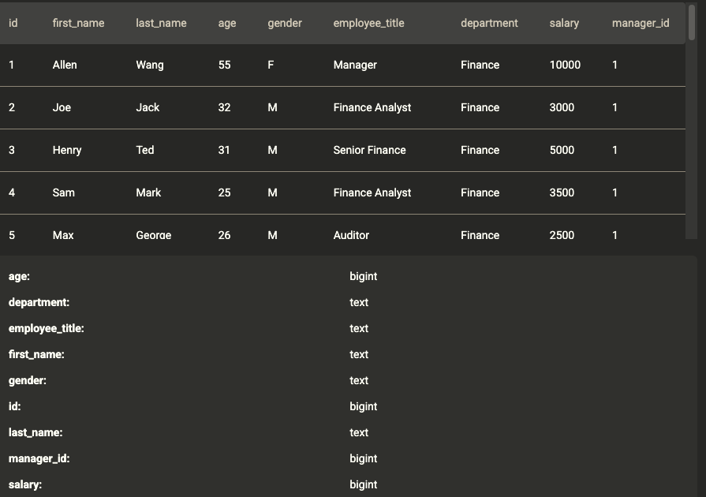
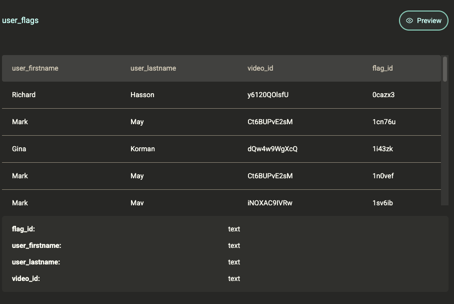
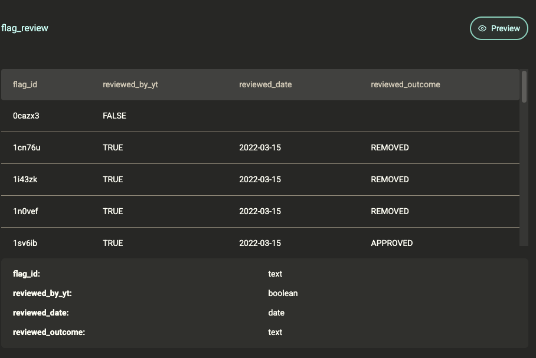

# SQL Exercises

A mix of self-written and sourced problems. Solve before looking at the solution.

---

## Exercise 1 — Department Manager and Employee Salary Comparison

**Problem:** Oracle is comparing the monthly wages of their employees in each department to those of their managers and co-workers.

You have been tasked with creating a table that compares an employee's salary to that of their manager and to the average salary of their department.

It is expected that the department manager's salary and the average salary of employee's from that department are in their own separate column.

Order the employee's salary from highest to lowest based on their department.
Your output should contain the department, employee id, salary of that employee, salary of that employee's manager and the average salary from employee's within that department rounded to the nearest whole number.

Note: Oracle have requested that you not include the department manager's salary in the average salary for that department in order to avoid skewing the results. Managers of each department do not report to anyone higher up; they are their own manager.

[link to exercice](https://platform.stratascratch.com/coding/2146-department-manager-and-employee-salary-comparison?code_type=1)



```sql
WITH avg_salary_by_department AS (
    SELECT department, ROUND(AVG(salary)) AS avg_salary
    FROM employee_o AS E
    WHERE E.employee_title != 'Manager'
    GROUP BY department
),
manager_salary_by_department AS (
    SELECT department, salary AS manager_salary
    FROM employee_o as E
    WHERE E.employee_title = 'Manager'
),
avg_salary_and_manager_salary_by_department AS (
    SELECT ms.department, avg_salary, manager_salary
    FROM manager_salary_by_department ms NATURAL JOIN avg_salary_by_department
)
SELECT       ASM.department,
                       E.id, 
                   E.salary, 
         ASM.manager_salary, 
             ASM.avg_salary
        FROM avg_salary_and_manager_salary_by_department AS ASM
NATURAL JOIN employee_o as E
ORDER BY department, salary DESC;

```


## Exercice 2 - Reviewed flags of top videos
For the video (or videos) that received the most user flags, how many of these flags were reviewed by YouTube? Output the video ID and the corresponding number of reviewed flags.  Ignore flags that do not have a corresponding flag_id.




```sql
WITH flag_counts AS (
    SELECT video_id, COUNT(flag_id) AS cnt
    FROM   user_flags
    GROUP BY video_id
),
top_videos AS (
    SELECT video_id
    FROM   flag_counts
    WHERE  cnt = (SELECT MAX(cnt) FROM flag_counts)
),
top_videos_flags AS (
SELECT video_id, fr.flag_id AS flag_id
FROM user_flags ur
NATURAL JOIN top_videos
LEFT JOIN flag_review fr
ON ur.flag_id = fr.flag_id
WHERE ur.flag_id IS NOT NULL AND fr.reviewed_by_yt
)
SELECT video_id, COUNT(flag_id)
FROM   top_videos_flags
GROUP BY video_id;
```
